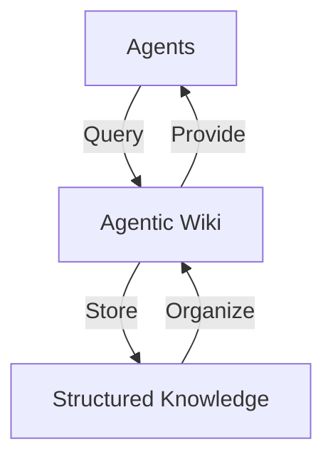

# Agentic Architecture Wiki

A compounding knowledge base for architecting autonomous agent systems in highly regulated environments.

This wiki serves as a centralized knowledge repository for agentic systems, designed to support both human understanding and AI-agent consumption.

## The Visual Architecture

To illustrate how this wiki functions as a "Long-Term Memory" for agents, here is a visual representation:

This diagram highlights the flow of information between agents and the wiki, emphasizing its role in storing, organizing, and providing structured knowledge.

## What I Learned

Transitioning from basic RAG (Retrieval-Augmented Generation) to the "Agentic Wiki" pattern has been a significant evolution in managing knowledge for agents. This approach has provided the following business ROI:

* **Reduced Token Cost**: By structuring knowledge in a reusable and query-efficient format, we minimize redundant token usage.
* **Higher Accuracy in Ticket Analysis**: The organized structure of the wiki enables agents to retrieve precise and contextually relevant information, improving ticket resolution accuracy.
* **Scalability**: The "Agentic Wiki" pattern supports long-term growth by acting as a centralized, well-structured memory for agents.

## Other Sections
