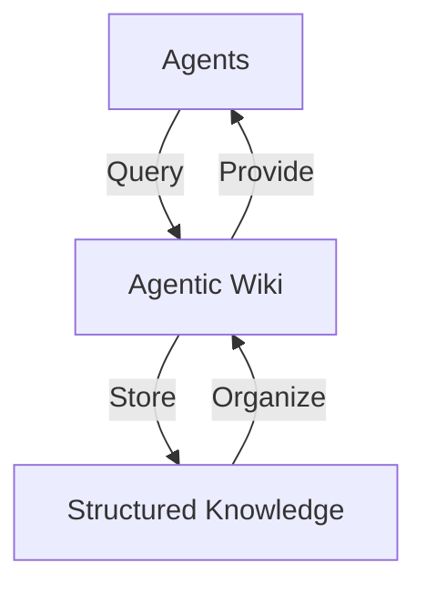

# Agentic Architecture Wiki
A compounding knowledge base for architecting autonomous agent systems in highly regulated environments.
This wiki serves as a centralized knowledge repository for agentic systems, designed to support both human understanding and AI-agent consumption.

## AI SDLC

The Software Development Life Cycle (SDLC) is the journey of software from an idea to a production system. 
It typically includes planning, design, development, testing, deployment, and maintenance, with different teams involved at each stage. 
Traditional SDLC processes rely heavily on documents, tickets, reviews, and approvals to ensure quality and accountability. 
However, many of these processes were designed when writing code was the most time-consuming part of development. 
With AI and agentic AI, we can automate and accelerate many activities across the SDLC while keeping humans involved for important decisions, reviews, and approvals. 
The goal is to make software development faster, more efficient, and still safe and controlled.


Instead of using AI only during the Build phase, AI becomes part of every stage:
```
Plan → Design → Build → Test → Deploy → Maintain → Plan
```


## The Visual Architecture

To illustrate how this wiki functions as a "Long-Term Memory" for agents, here is a visual representation:



This diagram highlights the flow of information between agents and the wiki, emphasizing its role in storing, organizing, and providing structured knowledge.

## What I Learned

Transitioning from basic RAG (Retrieval-Augmented Generation) to the "Agentic Wiki" pattern has been a significant evolution in managing knowledge for agents. This approach has provided the following business ROI:

* **Reduced Token Cost**: By structuring knowledge in a reusable and query-efficient format, we minimize redundant token usage.
* **Higher Accuracy in Ticket Analysis**: The organized structure of the wiki enables agents to retrieve precise and contextually relevant information, improving ticket resolution accuracy.
* **Scalability**: The "Agentic Wiki" pattern supports long-term growth by acting as a centralized, well-structured memory for agents.

## Other Sections
