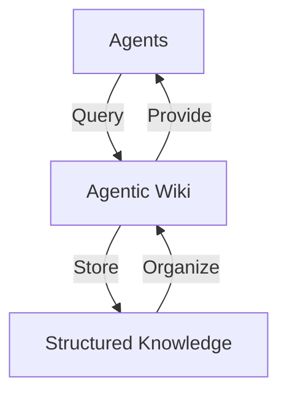

# Agentic Architecture Wiki
A compounding knowledge base for architecting autonomous agent systems in highly regulated environments.
This wiki serves as a centralized knowledge repository for agentic systems, designed to support both human understanding and AI-agent consumption.

## AI SDLC

The Software Development Life Cycle (SDLC) is the journey of software from an idea to a production system. 
It typically includes planning, design, development, testing, deployment, and maintenance, with different teams involved at each stage. 
Traditional SDLC processes rely heavily on documents, tickets, reviews, and approvals to ensure quality and accountability. 
However, many of these processes were designed when writing code was the most time-consuming part of development. 
With AI and agentic AI, we can automate and accelerate many activities across the SDLC while keeping humans involved for important decisions, reviews, and approvals. 
The goal is to make software development faster, more efficient, and still safe and controlled.


Instead of using AI only during the Build phase, AI becomes part of every stage:
```
Plan → Design → Build → Test → Deploy → Maintain → Plan
```
The artifact becomes the handoff, and the handoff can become the trigger for the next stage.
An AI-native SDLC turns the relay race into a continuous loop:

```
Plan → Design → Build → Test → Deploy → Maintain → Plan
```
### What Changes for Engineering Teams?

The biggest change isn't that engineers stop writing code. Instead, the engineer's role moves upward in the development lifecycle.

AI can help generate implementation details, but engineers still need to define intent, establish architectural boundaries, encode organizational knowledge, review important decisions, and ensure the system satisfies security, compliance, and reliability requirements.

For example, a repository can maintain a CLAUDE.md containing architecture conventions, build commands, testing practices, and common mistakes. Organizational standards can also be encoded as reusable skills so that AI consistently applies them rather than relying on every engineer to remember them.

Similarly, testing moves toward continuous evaluation, rather than treating QA as a final gate after development is complete.

### Human-in-the-Loop Still Matters

AI-native does not mean human-free.

The playbook's model keeps humans accountable for decisions requiring judgment while allowing AI to automate repetitive analysis, implementation, validation, and handoffs. Human attention can therefore concentrate on the places where it creates the most value—architecture, risk, security, compliance, product decisions, and critical production changes.

This is particularly important for regulated enterprises. If AI dramatically increases code production but security and governance processes remain human-speed, the organization simply creates a larger review queue.

The answer isn't to remove governance. It is to make governance executable and continuous.

### The Bigger Architectural Shift

The most interesting part of the AI-native SDLC is therefore not Claude Code or any individual AI tool.

It is the idea of turning the SDLC itself into an executable engineering system.

- Requirements become structured artifacts.
- Architecture knowledge becomes version-controlled context.
- Policies become machine-applicable skills.
- Tests become continuous evaluations.
- Reviews become layered AI-assisted analysis.
- Approval policies become automated gates.
-  Production signals become inputs to the next development cycle.

The result is a development lifecycle where AI accelerates the work, automation connects the stages, Git provides the history, and humans govern the important decisions.

That is a much bigger transformation than simply asking an AI assistant to "write some code."

## The Takeaway

The first generation of AI-assisted development focused on making developers faster.

The next generation is about making the entire software delivery system faster.

When code is no longer the primary bottleneck, organizations need to redesign everything around the code—planning, design, testing, security, deployment, governance, and production feedback.

That is the core idea behind an AI-Native SDLC: don't simply add AI to the existing process. Redesign the process around what AI agents can do, while deliberately keeping humans in control of the decisions that matter.


## The Visual Architecture

To illustrate how this wiki functions as a "Long-Term Memory" for agents, here is a visual representation:



This diagram highlights the flow of information between agents and the wiki, emphasizing its role in storing, organizing, and providing structured knowledge.

## What I Learned

Transitioning from basic RAG (Retrieval-Augmented Generation) to the "Agentic Wiki" pattern has been a significant evolution in managing knowledge for agents. This approach has provided the following business ROI:

* **Reduced Token Cost**: By structuring knowledge in a reusable and query-efficient format, we minimize redundant token usage.
* **Higher Accuracy in Ticket Analysis**: The organized structure of the wiki enables agents to retrieve precise and contextually relevant information, improving ticket resolution accuracy.
* **Scalability**: The "Agentic Wiki" pattern supports long-term growth by acting as a centralized, well-structured memory for agents.

## Other Sections
